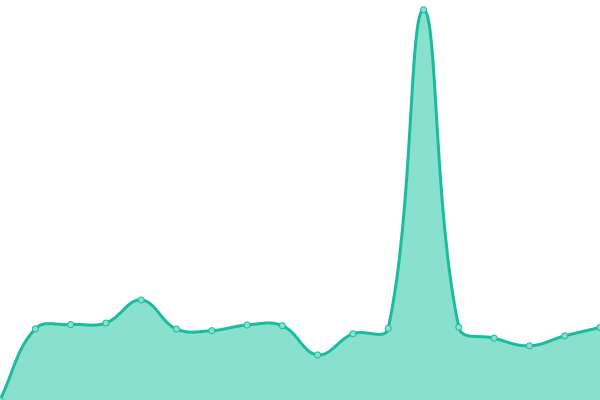
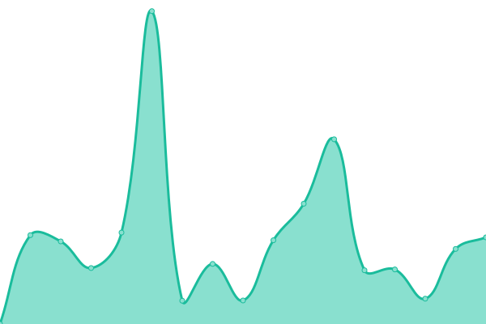
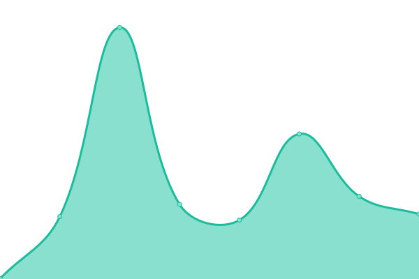
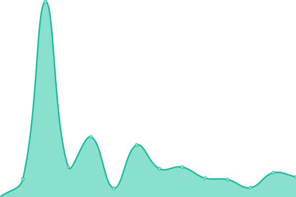
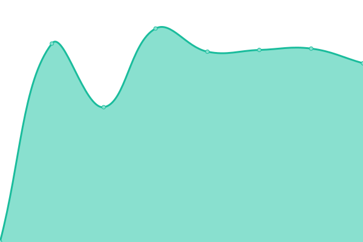

# [📈 Live Status](https://status.wreative.com): <!--live status--> **🟧 Partial outage**

This repository contains the open-source uptime monitor and status page for [Wreative](https://wreative.com), powered by [Upptime](https://github.com/upptime/upptime).

With [Upptime](https://upptime.js.org), you can get your own unlimited and free uptime monitor and status page, powered entirely by a GitHub repository. We use [Issues](https://github.com/wreative/status/issues) as incident reports, [Actions](https://github.com/wreative/status/actions) as uptime monitors, and [Pages](https://status.wreative.com) for the status page.

<!--start: status pages-->
<!-- This summary is generated by Upptime (https://github.com/upptime/upptime) -->
<!-- Do not edit this manually, your changes will be overwritten -->
<!-- prettier-ignore -->
| URL | Status | History | Response Time | Uptime |
| --- | ------ | ------- | ------------- | ------ |
|  [Wreative](https://wreative.com) | 🟩 Up | [wreative.yml](https://github.com/wreative/status/commits/HEAD/history/wreative.yml) | 

 2487ms
     
 | 

<a href="https://status.wreative.com/history/wreative">99.68%</a>
    

|  [Wreative Store](https://store.wreative.com) | 🟩 Up | [wreative-store.yml](https://github.com/wreative/status/commits/HEAD/history/wreative-store.yml) | 

 1258ms
     
 | 

<a href="https://status.wreative.com/history/wreative-store">99.46%</a>
    

|  [Wreative Showcase](https://showcase.wreative.com) | 🟩 Up | [wreative-showcase.yml](https://github.com/wreative/status/commits/HEAD/history/wreative-showcase.yml) | 

 376ms
     
 | 

<a href="https://status.wreative.com/history/wreative-showcase">100.00%</a>
    

|  [Infleet](https://infleet.id/up) | 🟩 Up | [infleet.yml](https://github.com/wreative/status/commits/HEAD/history/infleet.yml) | 

 1384ms
     
 | 

<a href="https://status.wreative.com/history/infleet">100.00%</a>
    

|  [TipoTix](https://tipotix.com/up) | 🟩 Up | [tipo-tix.yml](https://github.com/wreative/status/commits/HEAD/history/tipo-tix.yml) | 

 1413ms
     
 | 

<a href="https://status.wreative.com/history/tipo-tix">100.00%</a>
    

|  [TipoTix Barcode](https://tikcheck.tipotix.com/up) | 🟩 Up | [tipo-tix-barcode.yml](https://github.com/wreative/status/commits/HEAD/history/tipo-tix-barcode.yml) | 

 1048ms
     
 | 

<a href="https://status.wreative.com/history/tipo-tix-barcode">100.00%</a>
    

|  [Lumi Signal](https://lumi-signal.com/up) | 🟥 Down | [lumi-signal.yml](https://github.com/wreative/status/commits/HEAD/history/lumi-signal.yml) | 

 1109ms
     
 | 

<a href="https://status.wreative.com/history/lumi-signal">99.93%</a>
    

<!--end: status pages-->

[**Visit our status website →**](https://status.wreative.com)

## 📄 License

- Powered by: [Upptime](https://github.com/upptime/upptime)
- Code: [MIT](./LICENSE) © [Anand Chowdhary](https://anandchowdhary.com), supported by [Pabio](https://pabio.com)
- Data in the `./history` directory: [Open Database License](https://opendatacommons.org/licenses/odbl/1-0/)
